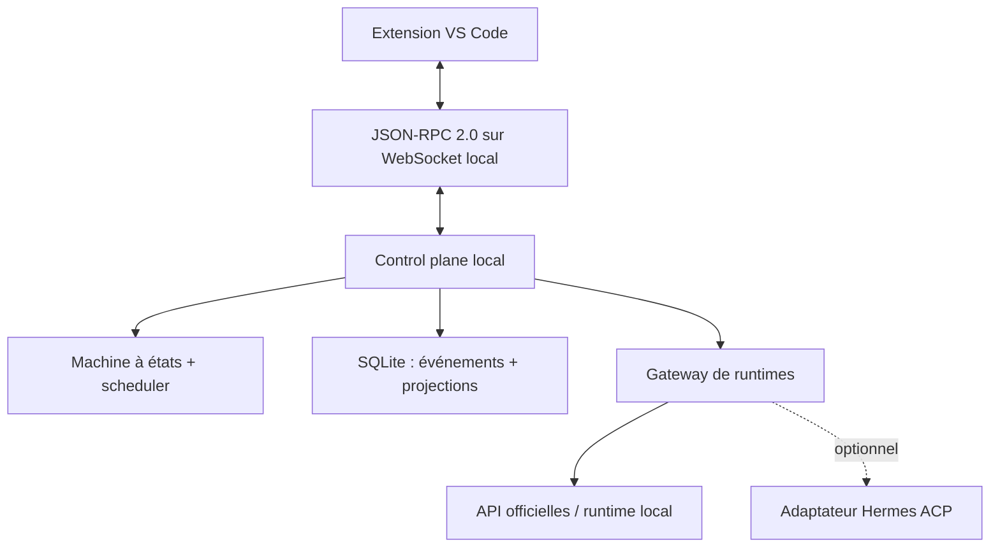
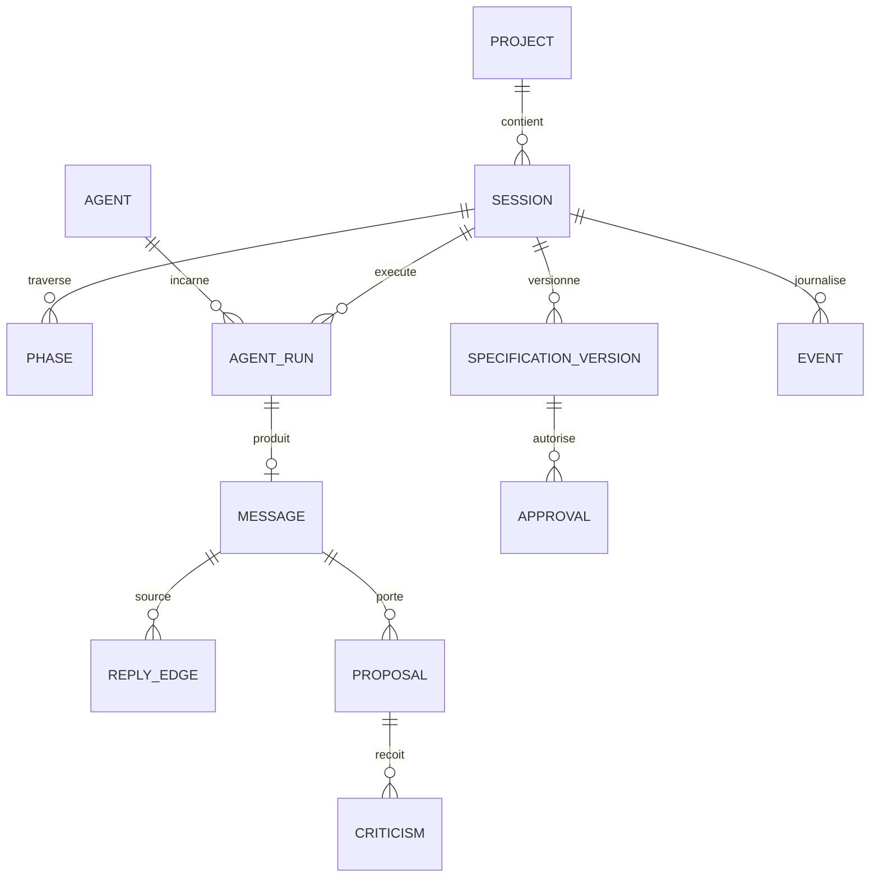
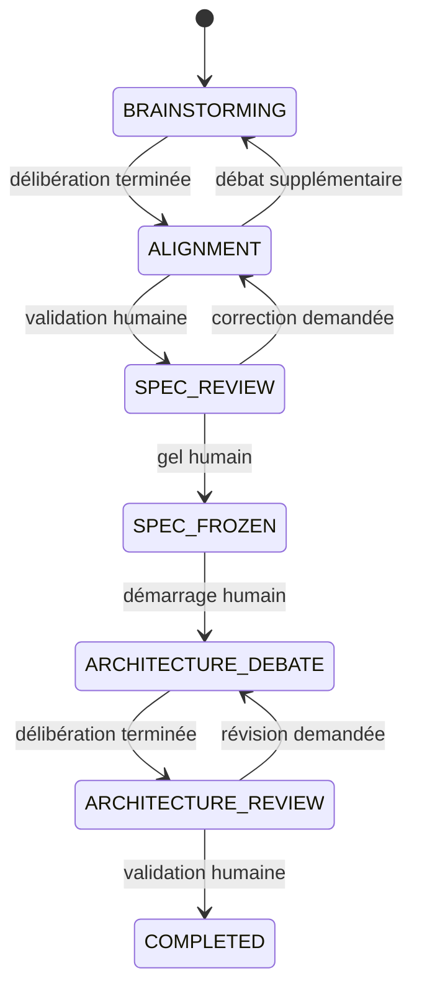

# Conception technique du prototype local-first de délibération multi-agents

> **Document de référence (design directeur) du prototype.** Ce document est la conception
> retenue. Il prime sur `faisabilite-ide-multi-agents.md` (cadrage produit long terme) pour
> tout ce qui concerne le périmètre, les invariants et l'implémentation du prototype.
> Les invariants sont figés dans `adr/0001-perimetre-invariants.md`.

Statut : proposition d'architecture pour décision et implémentation  
Date de vérification : 13 juillet 2026  
Portée : extension VS Code + service local, lecture seule, trois fournisseurs au maximum

## Décision d'architecture

Le plus petit prototype capable de confirmer ou réfuter l'hypothèse centrale est un système de délibération en lecture seule. Il ne doit contenir ni Kanban d'implémentation, ni terminal agent, ni worktrees, ni mémoire longue durée, ni modification autonome du dépôt.

La recommandation définitive est :

- extension VS Code en TypeScript avec une webview React ;
- daemon local indépendant en TypeScript/Node.js LTS ;
- protocole JSON-RPC 2.0 sur WebSocket loopback authentifié ;
- SQLite local, journal append-only et projections relationnelles ;
- machine à états déterministe écrite comme un reducer pur ;
- adaptateurs directs vers trois API officielles au maximum ;
- protocole fixe `PROPOSE -> CRITIQUE -> REVISE -> SYNTHESIZE` ;
- validation humaine avant le gel de la spécification et avant la validation de l'architecture ;
- Hermes absent du chemin critique, mais testable derrière une interface `AgentRuntimeAdapter`.

Le prototype n'a pas à démontrer que plusieurs agents savent coder ensemble. Il doit seulement mesurer si une délibération séquentielle visible produit de meilleurs cahiers des charges et architectures qu'un agent unique ou qu'un fan-out parallèle suivi d'une synthèse.

## 1. Critique du rapport de faisabilité

### 1.1 Disponibilité du document

Le dépôt [`mahi010110/Open-Day`](https://github.com/mahi010110/Open-Day) est accessible. Le chemin demandé n'existe toutefois pas sur la branche par défaut `main`, qui ne contient actuellement qu'un `README.md` minimal. Le document existe sur la branche `claude/multi-agent-ide-feasibility-2uan6a` : [`docs/faisabilite-ide-multi-agents.md`](https://github.com/mahi010110/Open-Day/blob/claude/multi-agent-ide-feasibility-2uan6a/docs/faisabilite-ide-multi-agents.md).

Le rapport est donc analysable, mais il n'est pas encore le document de référence de `main`. Cette différence de branche doit être réglée avant de le citer comme documentation officielle du projet.

### 1.2 Conclusions solides

| Conclusion du rapport | Appréciation |
|---|---|
| Le produit complet est réalisable mais très complexe. | Solide. L'essentiel du risque porte sur la fiabilité, l'UX, la maîtrise des coûts et l'évaluation, pas sur la possibilité de lancer plusieurs modèles. |
| Le MoA de Hermes n'est pas un débat entre pairs. | Solide et confirmé : les références sont appelées en parallèle, leurs sorties deviennent du contexte privé pour l'agrégateur, et seul ce dernier répond. [Documentation MoA actuelle](https://github.com/NousResearch/hermes-agent/blob/main/website/docs/user-guide/features/mixture-of-agents.md). |
| Le cycle besoin -> spécification gelée -> architecture -> validation humaine est le principal angle produit. | Solide comme stratégie de prototype. La primitive n'est pas techniquement nouvelle, mais son intégration opinionnée dans l'UX peut l'être. |
| Le consensus IA ne doit jamais remplacer une décision humaine. | Solide et doit devenir un invariant de la machine à états. |
| Le prototype doit être en lecture seule. | Solide. C'est même plus important que ne le laisse entendre le rapport : cela permet de supprimer presque toute l'infrastructure d'exécution. |
| L'utilisation commerciale de Hermes est permise par sa licence MIT, sous réserve des notices et des composants tiers. | Solide. [Licence actuelle](https://github.com/NousResearch/hermes-agent/blob/main/LICENSE). |
| BYOK et API officielles doivent être privilégiés. | Solide. Les mécanismes d'abonnements personnels non prévus pour un produit tiers sont exclus du prototype. |
| Hermes Kanban est local et mono-hôte par conception. | Solide ; sa documentation mentionne SQLite, des workers processus OS et le modèle single-host. [Documentation Kanban](https://github.com/NousResearch/hermes-agent/blob/main/website/docs/user-guide/features/kanban.md). |

### 1.3 Conclusions reposant sur des hypothèses

| Affirmation | Critique |
|---|---|
| « 60-70 % du cahier des charges est déjà livré par Hermes ». | Chiffre non démontré. Compter des cases de fonctionnalités ne mesure ni leur adéquation au protocole produit, ni la stabilité de leurs interfaces, ni le coût d'intégration. |
| Goal-mode et block/unblock couvriraient « 70 % » de la comparaison, du rejet et de la relance. | Estimation arbitraire. Ces primitives ne donnent ni le registre de décisions, ni la sémantique des réserves, ni les portes de phase. |
| Hermes fournit « tout le backend agentique ». | Trop fort. Hermes fournit de nombreuses capacités, mais pas le modèle de données, les invariants, le protocole de débat ou les preuves expérimentales du produit. |
| Un MVP serait réalisable en 4-8 semaines par une personne. | Optimiste si l'on inclut trois API réelles, streaming, annulation, persistance, reprise, webview VS Code et protocole d'évaluation. 4-8 semaines conviennent à un spike ; 8-12 semaines sont plus crédibles pour un prototype démontrable, hors campagne d'évaluation. |
| Tout refaire demanderait « 2 à 4 ans ». | Ordre de grandeur plausible pour le produit complet, mais non sourcé et inutile pour décider du prototype read-only. |
| Aucun outil n'impose un workflow équivalent. | Trop absolu. Des graphes comparables peuvent être construits avec plusieurs frameworks. La différence serait l'UX et les invariants prêts à l'emploi, pas l'impossibilité pour un concurrent de les reproduire. |

Le rapport annonce que les suppositions sont signalées, mais plusieurs pourcentages et estimations temporelles ne portent pas cette mention.

### 1.4 Affirmations à corriger ou vérifier davantage

- **ACP et persistance.** Le rapport affirme qu'un agent ACP survit à la fermeture de l'éditeur. La documentation actuelle dit que le gestionnaire des sessions ACP est en mémoire et que `list/load/resume/fork` sont limités au processus ACP en cours, même si le moteur Hermes possède ses propres chemins de persistance. Cette affirmation est donc trop générale. [Documentation ACP actuelle](https://github.com/NousResearch/hermes-agent/blob/main/website/docs/user-guide/features/acp.md).
- **Intégration VS Code.** Hermes fournit un serveur ACP ; VS Code passe actuellement par une extension cliente ACP tierce. Ce n'est pas une extension Hermes native livrant l'UX proposée.
- **Mémoire projet commune.** Des profils Hermes possèdent des mémoires séparées. Un répertoire partagé ou des commentaires Kanban ne constituent pas automatiquement une mémoire de projet gouvernée et cohérente.
- **Benchmark MoA.** Hermes documente maintenant un gain sur HermesBench et un réglage `reference_max_tokens`. Ce résultat justifie d'étudier l'agrégation, mais ne prouve pas qu'un débat séquentiel améliore la conception d'exigences ou d'architecture. L'extrapolation est insuffisamment prouvée.
- **Coûts exacts.** Les prix, tokens de cache et tokens de raisonnement varient selon les API. Un compteur local doit distinguer coût estimé et coût facturé.
- **Capacités des providers.** Les sorties structurées, l'annulation et les informations d'usage ne sont pas uniformes. Dire que le routage multi-provider est « résolu » sous-estime le travail de normalisation.

### 1.5 Évolution de Hermes depuis le rapport

Le rapport est daté du même jour et ne fixe pas le commit Hermes qu'il a inspecté ; une comparaison chronologique exacte n'est donc pas possible. L'état courant vérifié est la branche `main` au commit récent [`7f7a403`](https://github.com/NousResearch/hermes-agent/commit/7f7a40381e86d73bf69c78410e5d9bbefcca8a9a).

Évolutions ou clarifications pertinentes :

- Hermes persiste désormais les **événements de fin** d'une délégation en arrière-plan avant livraison. Cela ne rend pas l'exécution durable : un enfant en cours n'est pas repris après le redémarrage du processus et son état devient `unknown`. [Délégation actuelle](https://github.com/NousResearch/hermes-agent/blob/main/website/docs/user-guide/features/delegation.md).
- MoA documente un plafond de sortie des modèles de référence et un benchmark HermesBench. Sa sémantique reste un fan-out privé suivi d'un agrégateur, pas un débat visible.
- ACP expose toujours un ensemble important d'outils, y compris écriture et terminal, et conserve un gestionnaire de session lié au processus. Cela renforce la décision de ne pas en faire le chemin critique d'un prototype read-only.
- Les derniers commits observés concernent surtout le desktop et la livraison des complétions ; ils ne suppriment pas le besoin d'un plan de contrôle séparé.

### 1.6 Composants sous-estimés

- définition d'un protocole équitable entre conditions expérimentales ;
- effets de l'ordre des modèles et du rôle attribué à chaque fournisseur ;
- validation et réparation des sorties structurées ;
- annulation réelle, résultat tardif et facturation d'un appel annulé ;
- idempotence des commandes et reprise après crash ;
- construction de contextes comparables sans fuite entre les tours indépendants ;
- charge cognitive de la conversation visible ;
- évaluation aveugle et accord entre évaluateurs ;
- biais du coordinateur, qui peut effacer une réserve minoritaire ;
- stabilité d'une interface Hermes intégrée dans un produit tiers.

### 1.7 Composants surdimensionnés ou à retirer du prototype

À supprimer du premier prototype :

- Kanban Hermes, sous-agents d'implémentation et dispatcher ;
- worktrees, branches, diffs et fusion ;
- terminal, outils de fichiers et sandbox d'exécution ;
- middleware complet de permissions ; l'invariant suffit : aucun outil d'effet de bord n'existe ;
- mémoire longue durée, skills et RAG ;
- graphe de tâches ;
- application Tauri/desktop ;
- LiteLLM et fallback automatique si trois adaptateurs directs suffisent ;
- commit automatique de `.openday/spec.md` ; la spécification doit d'abord être versionnée dans SQLite et exportée uniquement par une action humaine ;
- embeddings dédiés à la détection de répétition ; des identifiants de claims et une empreinte lexicale suffisent ;
- juge LLM contrôlant les transitions ; le code et l'utilisateur les contrôlent.

## 2. Définition définitive du prototype

### 2.1 Hypothèse testée

À budget et contexte contrôlés, une délibération séquentielle visible entre plusieurs modèles de fournisseurs différents produit un cahier des charges et une architecture jugés meilleurs qu'un agent unique et qu'un fan-out parallèle suivi d'une synthèse.

### 2.2 Invariants

1. Aucun agent n'a accès à des outils de fichier, terminal, Git ou réseau général.
2. Chaque contribution importante est publique, attribuée et immuable.
3. Les réponses du premier tour utilisent le même snapshot et ne voient pas les autres réponses du tour.
4. Les transitions de gel de la spécification et de validation de l'architecture exigent une approbation humaine.
5. Une synthèse ne peut pas supprimer une réserve ; elle doit la référencer ou expliquer publiquement son rejet.
6. Les raisonnements privés des modèles ne sont ni demandés ni affichés. Seules des justifications publiques structurées sont stockées.
7. Le budget est vérifié avant chaque appel.
8. Trois adaptateurs de fournisseurs au maximum sont activés.
9. Toute commande mutante porte une clé d'idempotence.
10. Hermes peut disparaître sans rendre les sessions ou leurs données illisibles.

### 2.3 Inclus, exclu et simulé

| Inclus | Exclu | Simplifiable ou simulable |
|---|---|---|
| Extension VS Code et daemon local | IDE complet | Provider factice pour tests et démos hors ligne |
| Trois API officielles maximum | Cloud multi-utilisateur | Catalogue de prix statique et versionné |
| Rôles configurables par fichier | Éditeur graphique de rôles | Annulation best-effort avec rejet des réponses tardives |
| Transcript visible et messages ciblés | Outils et exécution | Réponses enregistrées pour tests UI |
| Propositions, critiques, révisions, synthèse | Worktrees et Git | Détection de répétition lexicale |
| Machine à états et journal | Kanban et graphe | Génération Markdown par template déterministe |
| Budget tokens/coût/temps | Mémoire vectorielle | Une seule session active simultanément dans la première démo |
| Spécification immuable et versionnée | Écriture automatique dans le workspace | Export manuel via « Save As » |
| Approbations humaines | Authentification multi-utilisateur | Credentials transmis en mémoire depuis VS Code SecretStorage |
| Mode d'évaluation A/B/C | Marketplace/plugins | Un seul coordinateur choisi parmi les trois modèles |

### 2.4 Choix des fournisseurs

Configuration de référence : adaptateurs OpenAI, Anthropic et Google utilisant leurs API officielles et les clés de l'utilisateur. Les rôles tournent entre les modèles pendant l'évaluation afin de ne pas confondre qualité du rôle et qualité du fournisseur.

Une alternative plus petite consiste à implémenter OpenAI, Anthropic et un adaptateur `OpenAICompatible` pour OpenRouter ou un modèle local. Elle est acceptable pour un spike, mais moins propre pour comparer trois fournisseurs directs.

## 3. Parcours complet d'une première session

Tâche de démonstration : « Concevoir l'architecture d'une application collaborative de gestion de projets. »

Agents configurés :

- `architecte` : cohérence fonctionnelle et architecture générale ;
- `critique` : alternatives, complexité, maintenabilité et hypothèses non prouvées ;
- `securite` : frontières de confiance, données, authentification et menaces ;
- `coordinateur` : rôle logique employant l'un des trois modèles, pas un quatrième fournisseur.

### Écran 0 — Connexion locale

- L'extension démarre ou rejoint le daemon.
- Elle affiche les trois fournisseurs, le modèle, l'état de la clé et un bouton de test.
- Les clés sont stockées par VS Code SecretStorage puis remises au daemon en mémoire ; elles ne sont jamais enregistrées dans SQLite.
- Événements : `DaemonConnected`, `ProviderConfigurationTested`.
- Aucun appel de modèle n'est encore effectué.

### Écran 1 — Nouvelle session

L'utilisateur saisit l'objectif, choisit les trois rôles, le budget, la limite de temps et confirme.

Sont enregistrés :

- `Project` lié au workspace VS Code, sans lecture de son contenu ;
- `Session` en `BRAINSTORMING` ;
- snapshot des rôles, modèles, prompts et prix ;
- événement `SessionCreated` ;
- instance de `Phase` et événement `PhaseEntered`.

### Écran 2 — Tour 1 : propositions indépendantes

Les trois agents reçoivent exactement le même snapshot : objectif utilisateur, contraintes explicites, schéma de sortie et description de leur rôle. Ils ne reçoivent aucune réponse des autres agents.

Format requis :

```json
{
  "public_summary": "...",
  "proposals": [{
    "topic": "architecture",
    "recommendation": "...",
    "tradeoffs": ["..."],
    "assumptions": ["..."]
  }],
  "open_questions": [{"text": "...", "blocking": true}],
  "public_justification": "..."
}
```

Les appels peuvent être concurrents, mais tous utilisent le snapshot `R1`. Chaque résultat validé produit `AgentRunCompleted`, `MessageCommitted` et `ProposalCreated`. L'UI affiche clairement « propositions indépendantes ».

L'utilisateur peut poser une question, mais sa réponse est mise en file pour le prochain point sûr afin de ne pas contaminer l'indépendance du tour en cours. Il peut aussi annuler un run.

### Écran 3 — Tour 2 : critiques croisées

Une barrière attend la fin ou l'échec explicite des trois propositions. L'assignation est déterministe : chaque agent critique la proposition suivante dans un anneau ; l'agent sécurité peut en plus cibler tout risque classé élevé. Maximum : deux critiques par agent.

Contexte : objectif, trois résumés structurés, proposition ciblée, questions utilisateur intervenues depuis le tour 1. Les longs textes non nécessaires sont exclus.

Format :

```json
{
  "criticisms": [{
    "target_proposal_id": "...",
    "category": "security|consistency|scope|cost|operability",
    "severity": "low|medium|high|blocking",
    "claim": "...",
    "evidence_or_test": "...",
    "requested_change": "..."
  }],
  "agreements": ["proposal-id"],
  "new_open_questions": []
}
```

Chaque critique crée un `Message`, un `ReplyEdge` et un ou plusieurs `Criticism`.

### Écran 4 — Tour 3 : réponses et révisions

Chaque agent reçoit sa proposition originale, les critiques entrantes, les réponses ciblées de l'utilisateur et les contraintes actives.

Format :

```json
{
  "position": "MAINTAIN|REVISE|WITHDRAW",
  "change_summary": "...",
  "responses": [{"criticism_id": "...", "answer": "..."}],
  "revised_proposal": {},
  "remaining_reservations": []
}
```

Une proposition révisée ne remplace pas la précédente : elle la référence avec `supersedes_proposal_id`. Un changement de position sans `change_summary` est rejeté par le validateur.

### Écran 5 — Synthèse et alignement

Le coordinateur reçoit seulement les artefacts structurés validés : propositions actives, critiques, réponses, questions et messages humains. Il doit produire :

- problème et objectifs ;
- périmètre inclus/exclu ;
- décisions proposées ;
- réserves associées à leurs auteurs ;
- questions ouvertes ;
- options rejetées et justification publique ;
- critères de réussite proposés.

La synthèse crée des `Decision` au statut `PROPOSED`, des `Reservation` et des `OpenQuestion`. Elle ne déclenche aucune transition.

L'utilisateur peut : répondre à une question, adresser un agent, demander un cycle supplémentaire, corriger une décision, ou approuver l'alignement. Toute correction est enregistrée comme message humain et événement ; elle n'écrase pas silencieusement la synthèse.

### Écran 6 — Revue du cahier des charges

Après `APPROVE_ALIGNMENT`, un template déterministe transforme l'alignement en Markdown. Un appel de modèle peut améliorer la formulation, mais ne peut inventer de décision absente.

Le draft contient : problème, objectifs, non-objectifs, parties prenantes, fonctionnalités, contraintes, sécurité, données, critères de réussite, décisions, réserves, questions non bloquantes et hypothèses.

Chaque sauvegarde matérielle crée une nouvelle `SpecificationVersion` immuable au statut `DRAFT`. L'utilisateur compare les versions, modifie explicitement le texte et choisit « Geler cette version ».

### Écran 7 — Spécification gelée

`APPROVE_SPEC` crée une `Approval` portant sur le hash exact du contenu. La version devient `FROZEN`, `Session.active_specification_version_id` est mis à jour et l'événement `SpecificationFrozen` est ajouté.

Aucun fichier du workspace n'est créé. Un bouton d'export manuel est disponible, mais cette action appartient à l'utilisateur.

### Écran 8 — Débat d'architecture

Le même protocole à trois étapes est rejoué, cette fois avec le cahier des charges gelé comme autorité :

- architecte : architecture principale, composants et flux ;
- critique : alternative et analyse de complexité ;
- sécurité : frontières de confiance et contrôles ;
- coordinateur : document d'architecture proposé et matrice décisions/exigences.

Les agents ne reçoivent pas tout le brainstorming : seulement la spécification gelée, les décisions actives, les réserves non résolues et les questions pertinentes.

### Écran 9 — Revue de l'architecture

L'utilisateur inspecte : architecture proposée, alternatives, risques, réserves, exigences couvertes et questions restantes. Il peut demander une révision ciblée ou approuver le hash exact de l'artefact.

`APPROVE_ARCHITECTURE` crée l'approbation finale et place la session en `COMPLETED`.

### Conditions d'arrêt

La session s'arrête en cas de : approbation finale, annulation humaine, budget épuisé, erreur irrécupérable, ou limite de cycle atteinte suivie d'une décision humaine. Une limite atteinte ne doit jamais être présentée comme un consensus.

## 4. Architecture technique recommandée



Le daemon écoute exclusivement sur l'interface loopback et choisit un port libre. L'extension le démarre et lit sur `stdout` une ligne de handshake contenant le port et un nonce éphémère. Chaque connexion WebSocket doit fournir ce nonce. Le daemon reste indépendant de VS Code au niveau du domaine et peut donc être lancé par le banc d'évaluation, mais il n'est ni un service réseau partagé, ni une plateforme cloud.

### 4.1 Composants et choix

| Composant | Responsabilité | Entrées / sorties | Choix recommandé | Alternative raisonnable | Justification |
|---|---|---|---|---|---|
| Extension VS Code | Créer/reprendre une session, afficher le fil, les réserves, les validations, le budget et les versions | Commandes utilisateur / vues et notifications | TypeScript, API VS Code, webview React + Vite | UI native VS Code uniquement | React facilite le fil adressable et la comparaison ; l'API native gère commandes, secrets et lifecycle |
| Protocole | Contrats versionnés entre UI et daemon | Requêtes, réponses, notifications | JSON-RPC 2.0 sur WebSocket, schémas Zod exportés en JSON Schema | stdio JSON-RPC | WebSocket permet plusieurs clients locaux et le streaming ; stdio est plus simple pour un spike |
| Control plane | Autorité sur sessions, transitions, appels et approbations | Commandes RPC / événements de domaine | Node.js LTS, TypeScript, Fastify + WebSocket | Rust ou Python | Une seule pile avec l'extension et des types partagés réduit le coût du prototype |
| Machine à états | Décider légalement chaque transition | État + événement / nouvel état + effets déclarés | Réducteur pur, union discriminée TypeScript, table exhaustive | XState | Le petit nombre d'états ne justifie pas une dépendance de workflow ; un réducteur pur se teste facilement |
| Scheduler | Exécuter les étapes et barrières, gérer concurrence et reprise | Plan de tour / `AgentRun` terminaux | File par session, `p-limit`, `AbortController`, barrières de phase | BullMQ | Une file durable distribuée serait prématurée ; les intentions de run sont déjà persistées dans SQLite |
| Gateway | Normaliser modèles, streaming, usage, erreurs et sorties structurées | `RuntimeRequest` / `RuntimeEvent` | Interface interne + SDK officiels OpenAI, Anthropic et Google | LiteLLM/OpenRouter ou API compatible OpenAI | Les SDK directs minimisent les ambiguïtés de facturation et de capacités pour seulement trois fournisseurs |
| Stockage | Conserver la vérité, reconstruire les vues et supporter l'audit | Transactions de domaine / événements + projections | SQLite WAL, `better-sqlite3`, migrations Drizzle | SQLite async, PGlite | Local, transactionnel, simple à inspecter et à sauvegarder ; pas de serveur de base de données |
| Budget | Réserver puis comptabiliser tokens, coût et appels | Estimation + usage / autorisation ou refus | Entiers en micro-unités monétaires, catalogue tarifaire versionné | Simple plafond de tokens | Le prix varie selon entrée, sortie, cache et modèle ; les nombres flottants sont à éviter |
| Annulation | Arrêter l'ordonnancement et ignorer les résultats tardifs | `CancelRun`, `CancelSession` / état terminal | `AbortController`, jeton de génération et statut atomique | Arrêt du processus entier | L'annulation fournisseur est imparfaite ; l'autorité locale doit refuser tout résultat hors génération active |
| Générateur de spécification | Construire un document traçable | Synthèse validée / Markdown canonique | Template déterministe puis, facultativement, réécriture sous contraintes | Génération libre par LLM | Le contenu décisionnel reste issu des objets approuvés, pas d'une nouvelle hallucination |
| Journal / export | Audit, diagnostic et jeu d'évaluation | Événements / JSONL expurgé | Table append-only + export JSONL | Logs texte | Un log texte ne garantit ni ordre, ni relations, ni rejouabilité |
| Secrets | Garder les clés hors du domaine | Référence de secret / clé en mémoire | `SecretStorage` VS Code ; variables d'environnement pour le CLI d'évaluation | Fichier `.env` | Aucune clé ne doit entrer dans SQLite, les événements, les prompts ou les exports |

### 4.2 Surface RPC minimale

Les commandes mutantes portent toutes un `commandId` unique et une `expectedSessionVersion` :

```text
project.open
session.create | session.get | session.pause | session.resume | session.cancel
deliberation.start | deliberation.continue | run.cancel
message.send | message.address
alignment.approve | specification.saveDraft | specification.approve
architecture.start | architecture.approve
budget.update
```

Le daemon émet notamment `event.appended`, `run.started`, `run.delta`, `run.completed`, `run.failed`, `phase.changed`, `budget.changed` et `approval.required`. `run.delta` est éphémère ; seuls les messages terminés et validés sont inscrits dans la vérité durable. Une reconnexion appelle `session.get(afterEventSequence)` afin de combler les événements manqués.

### 4.3 Frontières de confiance

- Le control plane, et jamais un modèle, autorise les transitions, consomme le budget et choisit l'instant de l'appel.
- Le modèle propose du contenu ; ses sorties sont des données non fiables, validées par schéma et longueur.
- Aucun outil, terminal, lecture de dépôt ou écriture de fichier n'est exposé aux agents dans ce prototype.
- La webview utilise une politique CSP stricte, des nonces de scripts et aucune ressource distante.
- Les prompts affichent les justifications publiques demandées, jamais une chaîne de pensée privée.

## 5. Modèle de données minimal

Toutes les clés sont des UUID v7 encodés en texte, les dates sont en UTC ISO-8601, les montants sont des entiers en microdollars et les contenus approuvables possèdent un SHA-256 canonique. Les tables métier sont des projections transactionnelles du journal d'événements ; elles évitent d'avoir à reconstruire toute l'interface à chaque lecture.



### 5.1 Entités

| Entité | Champs essentiels | Relations et contraintes |
|---|---|---|
| `Project` | `id`, `name`, `workspace_uri`, `created_at`, `settings_json`, `version` | `workspace_uri` est informatif et n'accorde aucun accès ; nom unique facultatif par profil local |
| `Session` | `id`, `project_id`, `title`, `state`, `deliberation_stage`, `active_phase_id`, `active_specification_version_id`, `budget_limit_microusd`, `spent_microusd`, `reserved_microusd`, `max_cycles`, `cycle_no`, `version`, `created_at`, `updated_at` | Un seul état courant ; `spent + reserved <= limit` avant tout démarrage ; verrou optimiste par `version` |
| `Phase` | `id`, `session_id`, `kind`, `ordinal`, `status`, `started_at`, `ended_at`, `input_snapshot_hash`, `output_artifact_id` | Un seul `ACTIVE` par session ; `(session_id, ordinal)` unique ; les entrées d'une phase sont figées |
| `Agent` | `id`, `session_id`, `display_name`, `role`, `runtime_adapter_id`, `provider`, `model`, `system_prompt_version`, `capabilities_json`, `position_status` | Les rôles sont configurables ; un agent est immuable pendant un cycle, sauf événement explicite de reconfiguration |
| `AgentRun` | `id`, `session_id`, `phase_id`, `agent_id`, `stage`, `cycle_no`, `attempt`, `status`, `request_hash`, `context_hash`, `started_at`, `ended_at`, `error_code`, `stop_reason`, `output_message_id` | `(session_id, phase_id, agent_id, stage, cycle_no, attempt)` unique ; au plus un run non terminal pour cette coordonnée |
| `Message` | `id`, `session_id`, `phase_id`, `author_type`, `author_agent_id`, `author_user_id`, `kind`, `content_text`, `structured_json`, `schema_version`, `status`, `created_at`, `content_hash` | Exactement un auteur humain ou agent ; un message `COMMITTED` est immuable ; tous les liens doivent rester dans la même session |
| `ReplyEdge` | `id`, `session_id`, `from_message_id`, `to_message_id`, `relation`, `created_at` | `relation ∈ {REPLY, CRITIQUE, REVISION, ADDRESSES}` ; paire + relation unique ; pas d'auto-lien |
| `Proposal` | `id`, `session_id`, `phase_id`, `message_id`, `agent_id`, `kind`, `title`, `summary`, `claims_json`, `status`, `supersedes_proposal_id`, `created_at` | L'auteur correspond à celui du message ; graphe de succession acyclique ; une seule révision `ACTIVE` par lignée |
| `Criticism` | `id`, `session_id`, `message_id`, `critic_agent_id`, `target_proposal_id`, `target_claim_id`, `severity`, `category`, `claim`, `evidence_or_test`, `requested_change`, `status` | Cible obligatoire et même session ; `severity` bornée ; résolution liée à une révision ou décision |
| `Decision` | `id`, `session_id`, `phase_id`, `title`, `statement`, `status`, `selected_proposal_id`, `rationale_public`, `decided_by`, `decided_at`, `supersedes_decision_id` | `status ∈ {PROPOSED, ACCEPTED, REJECTED, SUPERSEDED}` ; seul un événement humain peut rendre une décision majeure `ACCEPTED` |
| `Reservation` | `id`, `session_id`, `decision_id`, `agent_id`, `message_id`, `statement`, `severity`, `status`, `resolution_text`, `resolved_by`, `resolved_at` | Représente un désaccord, pas une réserve budgétaire ; ne peut être supprimée, seulement résolue ou explicitement acceptée par l'humain |
| `OpenQuestion` | `id`, `session_id`, `phase_id`, `asked_by_type`, `asked_by_id`, `question`, `blocking`, `status`, `answer_message_id`, `resolved_at` | Toute question bloquante doit être `ANSWERED` ou `WAIVED` avec auteur humain avant le gel |
| `SpecificationVersion` | `id`, `session_id`, `version_no`, `based_on_id`, `status`, `markdown`, `content_hash`, `source_snapshot_hash`, `created_by`, `created_at`, `frozen_at` | `(session_id, version_no)` unique ; une version `FROZEN` est immuable ; une seule version active, les anciennes restent consultables |
| `Approval` | `id`, `session_id`, `phase_id`, `kind`, `subject_type`, `subject_id`, `subject_hash`, `actor_type`, `actor_id`, `decision`, `comment`, `command_id`, `created_at` | Pour les gates, `actor_type=HUMAN` ; l'approbation ne vaut que pour le hash exact ; `command_id` unique |
| `UsageRecord` | `id`, `session_id`, `agent_run_id`, `provider`, `model`, `input_tokens`, `output_tokens`, `cached_tokens`, `estimated`, `price_catalog_version`, `cost_microusd`, `recorded_at` | Un enregistrement final par run et éventuellement des estimations intermédiaires ; valeurs non négatives |
| `Event` | `id`, `session_id`, `sequence`, `type`, `schema_version`, `actor_type`, `actor_id`, `command_id`, `causation_id`, `correlation_id`, `payload_json`, `created_at` | `(session_id, sequence)` et `command_id` uniques ; append-only ; ordre alloué dans la transaction |
| `Artifact` | `id`, `session_id`, `phase_id`, `type`, `content`, `content_hash`, `schema_version`, `created_at` | Synthèse et architecture proposées ; immuables et adressables par hash |
| `CostReservation` | `id`, `session_id`, `agent_run_id`, `amount_microusd`, `status`, `expires_at`, `created_at` | Distingue le contrôle budgétaire d'une `Reservation` de désaccord ; unique par tentative de run |

### 5.2 Contraintes critiques

1. Une transaction de commande écrit l'événement, met à jour les projections et incrémente `Session.version` atomiquement.
2. Le serveur vérifie que toute référence croisée appartient à la même session et au snapshot de phase attendu.
3. Un résultat fournisseur ne peut être commis que si le `AgentRun` est encore `RUNNING` et si son jeton de génération correspond à la génération active.
4. Le gel et l'approbation d'architecture portent sur un hash canonique, jamais sur « la dernière version » implicite.
5. Les suppressions physiques sont interdites dans le flux normal ; les corrections créent une nouvelle version ou un événement compensatoire.
6. Les sorties brutes nécessaires au diagnostic peuvent être chiffrées localement ou désactivées ; les exports d'évaluation doivent expurger clés, identifiants et contenu explicitement privé.

## 6. Machine à états minimale et déterministe

`deliberation_stage ∈ {PROPOSE, CRITIQUE, REVISE, SYNTHESIZE}` est un sous-état interne de `BRAINSTORMING` et `ARCHITECTURE_DEBATE`, pas un état de cycle de vie supplémentaire.



`PAUSED`, `CANCELLED`, `BUDGET_EXHAUSTED` et `FAILED` sont des sorties transversales. `PAUSED` conserve `paused_from_state`; `BUDGET_EXHAUSTED` conserve l'étape et le checkpoint ; `CANCELLED` et `COMPLETED` sont terminaux. Une modification du cahier des charges gelé crée une nouvelle version : elle ne dégèle jamais l'ancienne.

### 6.1 Table des transitions

| De | Événement | Gardes obligatoires | Gate humain | Effets | Retour possible |
|---|---|---|---|---|---|
| — | `SESSION_CREATED` | Configuration valide, 2–3 agents, budget positif | Création explicite | Snapshot configuration, phase active, événement initial | Annulation |
| `BRAINSTORMING` | `DELIBERATION_FINISHED` | Tous les runs prévus sont terminaux, synthèse structurée valide, aucune réservation de coût pendante | Non | Ferme la phase, crée décisions/réserves/questions proposées, ouvre `ALIGNMENT` | `REQUEST_MORE_DEBATE` |
| `ALIGNMENT` | `APPROVE_ALIGNMENT` | Questions bloquantes répondues ou levées par l'humain, synthèse courante non obsolète | Oui | Approbation du hash, création d'un draft de spécification, ouverture `SPEC_REVIEW` | Rejet vers `ALIGNMENT` |
| `ALIGNMENT` | `REQUEST_MORE_DEBATE` | Budget et cycles disponibles | Oui | Nouveau snapshot et nouveau cycle `BRAINSTORMING` | — |
| `SPEC_REVIEW` | `SAVE_SPEC_DRAFT` | Base/version attendue, Markdown valide | Action humaine | Nouvelle `SpecificationVersion(DRAFT)` ; état inchangé | Autant de drafts que nécessaire |
| `SPEC_REVIEW` | `APPROVE_SPEC` | Draft courant, hash fourni exact, checklist complète, aucun bloqueur non levé | Oui | `Approval`, version `FROZEN`, pointeur actif, événement de gel | Amendement explicite seulement |
| `SPEC_REVIEW` | `REJECT_SPEC` | Commentaire non vide | Oui | Retour `ALIGNMENT`, draft conservé | — |
| `SPEC_FROZEN` | `START_ARCHITECTURE` | Version active gelée, configuration valide, budget disponible | Oui | Snapshot du cahier des charges, phase d'architecture | Pause/annulation |
| `ARCHITECTURE_DEBATE` | `DELIBERATION_FINISHED` | Même garde de barrière, artefact d'architecture valide et traçable vers la spec | Non | Ouvre `ARCHITECTURE_REVIEW` | Révision ciblée |
| `ARCHITECTURE_REVIEW` | `REQUEST_ARCH_REVISION` | Motif et cibles indiqués, budget/cycle disponibles | Oui | Nouveau cycle avec snapshot des demandes | — |
| `ARCHITECTURE_REVIEW` | `APPROVE_ARCHITECTURE` | Hash exact, réserves critiques résolues ou acceptées, couverture des exigences enregistrée | Oui | Approbation et `COMPLETED` | Aucun ; nouvelle session pour poursuivre |
| `SPEC_FROZEN` ou architecture | `REQUEST_SPEC_AMENDMENT` | Motif explicite | Oui | Nouveau draft fondé sur la version gelée ; architecture marquée `STALE`; passage `SPEC_REVIEW` | Nouveau gel requis |
| Tout état actif | `PAUSE_REQUESTED` | — | Oui | Annule les runs actifs, sauvegarde checkpoint et origine, passe `PAUSED` | `RESUME_REQUESTED` vers l'origine |
| `PAUSED` | `RESUME_REQUESTED` | Configuration et budget encore valides | Oui | Reprend au dernier checkpoint, jamais au milieu d'un message | Pause |
| Tout état non terminal | `CANCEL_REQUESTED` | — | Oui | Annule, libère réservations estimées, passe `CANCELLED` | Aucun |
| Tout état appelant | `BUDGET_DENIED` | Coût réservé dépasserait le plafond | Non | N'émet aucun appel, passe `BUDGET_EXHAUSTED` | Hausse humaine du budget puis reprise |
| Tout état actif | `UNRECOVERABLE_ERROR` | Erreur classée non récupérable ou retry épuisé | Non | Journalise un code expurgé et passe `FAILED` | Retry humain depuis checkpoint si classé récupérable |

### 6.2 Idempotence et reprise

- Le même `commandId` renvoie le résultat déjà enregistré ; il ne réapplique jamais les effets.
- Une commande mutante avec une `expectedSessionVersion` obsolète reçoit `CONFLICT` et la vue courante.
- Chaque appel est identifié par `(phase, cycle, stage, agent, attempt)`. Un retry crée `attempt + 1`, il ne réutilise pas l'identité du premier appel.
- Le lancement suit un motif transactionnel : intention et réservation de coût en base, appel hors transaction, puis commit conditionnel du résultat.
- Au redémarrage, une intention `RUNNING` sans processus vivant devient `INTERRUPTED`. L'utilisateur choisit de relancer ; aucune requête potentiellement facturable n'est réémise silencieusement.
- Les effets UI sont dérivés des événements numérotés ; une notification dupliquée est donc sans effet.

## 7. Protocole de délibération

### 7.1 Algorithme d'un cycle

Pour trois agents, le plafond nominal est de dix appels par phase : trois propositions, trois critiques, trois révisions et une synthèse. Les appels d'un même étage peuvent être exécutés en parallèle, mais leur affichage suit un ordre stable choisi au début de la session. Ils partagent exactement le même snapshot d'entrée.

1. **Propositions indépendantes.** Chaque agent reçoit le prompt humain, les contraintes connues, son rôle et le schéma de sortie. Il ne reçoit aucune proposition concurrente. Résultat : une proposition avec claims identifiés, hypothèses, risques et questions.
2. **Critiques croisées.** Le scheduler construit une matrice déterministe : chaque agent critique les deux autres propositions, jamais la sienne. Il doit cibler `proposal_id` et, si possible, `claim_id`, distinguer défaut, compromis et préférence, et proposer un test ou une correction.
3. **Réponse/révision.** Chaque auteur reçoit sa proposition et les critiques qui la ciblent. Il répond à chacune par `ACCEPT`, `PARTIAL`, `REJECT_WITH_EVIDENCE` ou `DEFER_TO_HUMAN`, puis maintient, révise ou retire sa proposition. Toute évolution doit comporter un résumé de changement.
4. **Synthèse.** Le coordinateur reçoit les seuls artefacts validés et prépare une carte des accords, conflits, décisions proposées, réserves nominatives et questions. Il ne peut résoudre une question marquée `HUMAN` ni supprimer une réserve.
5. **Arbitrage.** L'utilisateur peut approuver, corriger, choisir une option, demander une réponse ciblée ou lancer au plus un cycle supplémentaire. Ce choix, et non la synthèse du modèle, détermine la transition.

Une intervention utilisateur est acceptée à tout moment :

- avant le départ d'un étage, elle rejoint son snapshot ;
- pendant des appels, elle est enregistrée immédiatement puis appliquée au prochain point de barrière ;
- l'utilisateur peut aussi annuler l'étage et le redémarrer avec son intervention ; les réponses partielles annulées ne deviennent pas des arguments officiels.

### 7.2 Enveloppe de contexte

Chaque requête contient une enveloppe explicitement construite, jamais « tout l'historique » :

```json
{
  "authoritative": ["user_goal", "active_constraints", "frozen_spec_if_any"],
  "stage_inputs": ["selected_proposals_or_criticisms"],
  "human_messages": ["relevant_addressed_messages"],
  "unresolved": ["reservations", "open_questions"],
  "output_contract": {"schema": "...", "max_items": 12},
  "provenance": {"snapshot_hash": "...", "message_ids": ["..."]}
}
```

Le contexte est limité par nombre d'objets et par tokens. Si la limite est dépassée, le code conserve d'abord le cahier des charges, les messages humains et les éléments non résolus ; il remplace les éléments clos par leurs objets structurés. Pour le prototype, aucune mémoire vectorielle n'est nécessaire.

### 7.3 Contrôles contre les échecs usuels

| Risque | Contrôle déterministe | Rôle éventuel du coordinateur |
|---|---|---|
| Répétition | Empreinte lexicale par claim, cibles obligatoires, rejet d'une critique sans nouveauté identifiable, plafond d'items | Reformuler ou regrouper, sans décider que le débat est clos |
| Conversation infinie | Nombre fixe d'étages, `max_cycles`, plafond d'appels et gate humain pour tout nouveau cycle | Signaler le rendement marginal estimé |
| Faux consensus | Statut de position par agent, réserves conservées, impossibilité de convertir une réserve en accord | Exposer les accords et désaccords séparément |
| Position instable | `MAINTAIN/REVISE/WITHDRAW`, `supersedes`, résumé obligatoire et historique immuable | Expliquer publiquement les raisons de la révision |
| Contexte excessif | Sélection par identifiants, snapshots, plafonds, artefacts structurés | Suggérer ce qui est pertinent, sans pouvoir supprimer les entrées autoritatives |
| Explosion des coûts | Réservation avant appel, plafond de tokens/sortie, un seul retry de réparation, prix versionné | Proposer de sauter un appel ; le code tranche selon la politique |
| Sortie invalide | Validation Zod/JSON Schema, une réparation ciblée maximum, sinon run en échec | Produire la correction au schéma demandée |
| Biais du coordinateur | Provenance obligatoire, couverture de chaque proposition/réserve, rôle tournant dans l'évaluation | Synthétiser seulement ; aucune transition ni approbation |

Le code contrôle donc l'ordre, les entrées, le budget, la validation, les barrières, les transitions et la persistance. Le coordinateur IA peut classer, reformuler, comparer et proposer une décision. Il ne contrôle jamais les permissions, la vérité des événements, les gates humains ni le critère d'arrêt.

## 8. Place exacte de Hermes Agent

### 8.1 Décision

Hermes ne doit pas être le control plane du prototype. Il peut être un runtime interchangeable derrière le même contrat que les adaptateurs directs. Le chemin par défaut doit fonctionner sans installation de Hermes.

Cette frontière permet de tester deux choses séparément : la valeur du protocole de délibération et l'intérêt opérationnel de Hermes. Elle évite aussi d'hériter, dans le cœur du produit, de ses notions de session, profil, délégation ou Kanban qui ne correspondent pas exactement à nos invariants.

### 8.2 Ce qui est réutilisable immédiatement

| Fonction Hermes | Usage prototype | Interface | Décision |
|---|---|---|---|
| Sélection/configuration de plusieurs fournisseurs et modèles | Exécuter un agent via une configuration Hermes existante | ACP sur `stdio`, processus enfant `hermes acp` | Expérience optionnelle, après les adaptateurs directs |
| Streaming de messages | Convertir les updates ACP en `RuntimeEvent.delta` | ACP | Réutilisable sous test de contrat |
| Persistance/profils Hermes | Faciliter la configuration locale d'un utilisateur Hermes | Référence de profil passée à l'adaptateur | Non autoritative ; jamais source de l'état de session |
| Boucle d'outils, terminal, fichiers, web | Aucune utilité pour l'hypothèse actuelle | — | Désactivée et isolée |
| MoA | Réponses de référence parallèles suivies d'un agrégateur | Commande/configuration Hermes | Ne pas utiliser : cela confondrait notre condition expérimentale et ne produit pas un débat visible |
| Délégation, Kanban, worktrees | Implémentation autonome future | Outils Hermes | Hors prototype |
| Mémoire et skills | Contexte durable futur | Outils/profil Hermes | Hors prototype, car ils introduisent un facteur expérimental et des données difficiles à contrôler |

ACP expose aujourd'hui un ensemble d'outils incluant notamment écriture/patch, terminal, web, mémoire et délégation. Un simple prompt « lecture seule » n'est donc pas une frontière de sécurité. L'adaptateur Hermes ne doit être activé que si le processus utilise un répertoire de travail vide ou monté en lecture seule, un profil isolé et une politique qui refuse toute demande d'approbation d'outil. Si l'implémentation ACP ne permet pas de garantir ce contrat, Hermes reste désactivé pour le prototype.

### 8.3 Contrat `AgentRuntimeAdapter`

```ts
type RuntimeCapability =
  | "streaming"
  | "structured-output"
  | "usage-reporting"
  | "cancellation";

interface RuntimeRequest<T> {
  runId: string;
  sessionId: string;
  agentId: string;
  provider: string;
  model: string;
  systemInstruction: string;
  messages: Array<{ role: "user" | "assistant"; content: string }>;
  responseSchema: JsonSchema<T>;
  maxOutputTokens: number;
  deadlineAt: string;
  credentialRef?: string;       // résolu hors persistance métier
  contextHash: string;
}

type RuntimeEvent<T> =
  | { type: "delta"; text: string }
  | { type: "usage"; inputTokens: number; outputTokens: number; cachedTokens?: number; estimated: boolean }
  | { type: "completed"; value: T; rawText: string; providerRequestId?: string }
  | { type: "failed"; code: string; retryable: boolean; safeMessage: string };

interface AgentRuntimeAdapter {
  readonly id: string;
  capabilities(): Promise<ReadonlySet<RuntimeCapability>>;
  validateConfiguration(): Promise<{ ok: boolean; errors: string[] }>;
  estimate<T>(request: RuntimeRequest<T>): Promise<{
    maxInputTokens: number;
    maxOutputTokens: number;
    reservedCostMicrousd: number;
    priceCatalogVersion: string;
  }>;
  run<T>(request: RuntimeRequest<T>, signal: AbortSignal): AsyncIterable<RuntimeEvent<T>>;
  healthCheck(): Promise<{ ok: boolean; version?: string }>;
  dispose(): Promise<void>;
}
```

`DirectProviderRuntimeAdapter` implémente ce contrat avec les SDK officiels. `HermesAcpRuntimeAdapter` lance une version épinglée de Hermes, négocie ACP, mappe prompts et mises à jour, puis valide la sortie avec le même schéma local. Il ne reçoit ni les entités de domaine, ni les approbations, ni le budget restant.

Les données exclusivement détenues par notre control plane sont : projets, sessions, phases, graphes de messages, décisions, réserves, questions, versions de spécification, approbations, limites, coûts consolidés, événements, ordre des tours et checkpoints. Une éventuelle session interne Hermes est un détail de transport jetable.

### 8.4 Risques de couplage et tests de contrat

Risques : évolution d'ACP, différence entre streaming annoncé et réel, format des usages, sessions ACP limitées au processus courant, outils disponibles par défaut, sémantique d'annulation, double persistance, configuration/version Python et changements rapides de Hermes.

La CI doit exécuter la même suite contre un faux runtime, chaque adaptateur direct et une version Hermes épinglée :

1. handshake et détection de capacités ;
2. sortie structurée valide et réparation d'une sortie invalide ;
3. ordre des deltas et un seul terminal ;
4. annulation avant/puis pendant le premier token ;
5. timeout et erreur fournisseur expurgée ;
6. usage absent, partiel et final ;
7. résultat tardif ignoré après annulation ;
8. redémarrage du processus sans supposer la reprise ACP ;
9. vérification qu'aucun fichier sentinelle ne peut être lu ou modifié ;
10. compatibilité avec la version Hermes épinglée et test informatif sur sa branche principale.

## 9. Structure initiale du dépôt

```text
apps/
  vscode-extension/          # activation, commandes, SecretStorage, webview
services/
  control-plane/             # serveur local, RPC, composition et lifecycle
packages/
  protocol/                  # méthodes RPC, DTO, Zod et version du protocole
  domain/                    # entités, événements, invariants et FSM pure
  deliberation/              # scheduler, snapshots, prompts et validateurs
  provider-adapters/         # OpenAI, Anthropic, Google
  runtime-adapters/          # contrat, fake runtime, Hermes ACP optionnel
  storage/                   # schéma SQLite, migrations et repositories
  ui/                        # composants de webview sans dépendance VS Code
  evaluation-kit/            # conditions A/B/C, randomisation, scoring, exports
docs/
  architecture/              # vues système, données, sécurité et protocole
  adr/                       # décisions et alternatives rejetées
  specifications/            # schémas de sorties et exemple de spec
  evaluation/                # protocole préenregistré et jeux de tâches
fixtures/
  runtime-scenarios/         # streams, erreurs, délais et usages reproductibles
tests/
  unit/                      # FSM, budget, validation, sélection de contexte
  contract/                  # tous les AgentRuntimeAdapter
  integration/               # daemon + SQLite + faux runtime
  e2e/                       # extension VS Code + daemon
  evaluation/                # vérification du harness et des exports aveugles
```

Le monorepo `pnpm` utilise TypeScript strict, un `tsconfig` partagé et des versions épinglées. `domain` ne dépend d'aucun SDK ni de VS Code ; `protocol` ne contient aucune logique métier ; les adaptateurs dépendent du contrat, jamais l'inverse. Les prompts sont versionnés comme des ressources et leur hash est attaché à chaque run.

## 10. Plan d'évaluation

> **⚠️ Section superseded (2026-07-13).** Après état de l'art, ce plan (conditions A/B/C, 120
> productions) est remplacé par le protocole corrigé de `etat-art-scientifique.md` : conditions
> **A/B/C/D + C+**, contraste principal **D vs C(+) à budget égal**, pilote **32 artefacts** avec
> gate à 8 tâches. La section ci-dessous est conservée pour l'historique du design.

### 10.1 Conditions comparées

| Condition | Description | Contrôle de l'équité |
|---|---|---|
| A — agent unique | Un modèle performant produit puis auto-révise une spécification et une architecture | Même objectif, mêmes documents, plafond de coût primaire identique et possibilité d'une auto-critique |
| B — parallèle + synthèse | Trois modèles proposent indépendamment ; un coordinateur synthétise sans critiques croisées | Mêmes modèles, rôles, coordinateur et formats que C |
| C — débat séquentiel | Propositions, critiques croisées, révisions puis synthèse | Seule la visibilité des contributions antérieures et la réponse structurée changent par rapport à B |

Le modèle-coordinateur et l'association modèle/rôle sont tournés selon un carré latin. Sans cette rotation, une victoire de C pourrait seulement indiquer que le meilleur modèle a reçu le meilleur rôle. L'analyse principale est **à budget maximal égal** ; une analyse secondaire mesure le mode « pragmatique » à protocole complet et coût réel.

### 10.2 Tâches et volume

- Pilote : 6 tâches utilisées pour stabiliser prompts, barème et UI, puis exclues des résultats.
- Étude principale : 30 tâches inédites × 3 conditions = 90 sessions.
- Répétabilité : 10 de ces tâches rejouées une seconde fois dans les 3 conditions = 30 sessions supplémentaires.
- Total recommandé : 120 productions évaluables. Un développeur seul peut lancer le banc, mais l'évaluation crédible requiert au moins trois évaluateurs humains n'ayant pas vu la condition.

Les 30 tâches couvrent six familles équilibrées : architecture web collaborative, API et données, système local-first/synchronisation, intégration existante, sécurité/confidentialité et contraintes non fonctionnelles/performance. Chaque tâche possède une fiche cachée de 8–15 exigences, compromis et pièges, préparée avant les exécutions.

### 10.3 Mesures

**Qualité, score 1–5 par dimension :** compréhension du besoin, couverture des exigences cachées, cohérence, faisabilité, sécurité, gestion des compromis, testabilité, qualité des décisions et traçabilité entre cahier des charges et architecture. Les évaluateurs signalent aussi les défauts fatals et classent les trois résultats par préférence.

**Opérations :** tokens d'entrée/sortie/cache, coût réel et estimé, nombre d'appels, latence au premier résultat utile, durée totale, temps actif demandé à l'utilisateur, taux de sortie invalide/réparation, erreurs, annulations et sessions complétées.

Les artefacts sont normalisés, débarrassés des noms d'agents et présentés dans un ordre aléatoire. Deux évaluateurs notent chaque production ; un troisième arbitre les écarts supérieurs à un point. Il faut publier l'accord inter-évaluateurs et des intervalles de confiance bootstrap par tâche. Une analyse à effets mixtes `condition + famille + (1|tâche) + (1|évaluateur)` est préférable à une simple moyenne.

### 10.4 Seuils préenregistrés

Poursuivre si, sur l'étude principale :

- C dépasse A d'au moins **0,40 point sur 5** et B d'au moins **0,25**, avec intervalle de confiance à 95 % au-dessus de zéro ;
- C réduit les omissions/défauts fatals d'au moins **25 %** ;
- C est préféré dans au moins **60 %** des comparaisons contre A et **55 %** contre B ;
- au moins **90 %** des sessions C terminent, moins de **5 %** des runs restent invalides, la médiane est inférieure à **10 minutes** et le temps actif humain à **4 minutes** ;
- dans le mode pragmatique, la médiane de coût de C ne dépasse pas **1,5×** celle de A sans gain de qualité supplémentaire démontré.

Pivoter vers « réponses parallèles + synthèse » si C ne bat pas B mais B bat A. Réduire le protocole si le gain n'apparaît que sur les tâches à haut risque. Abandonner l'hypothèse produit si C ne bat ni A ni B après contrôle des bugs et si la borne haute de l'intervalle exclut un gain utile de 0,25 point. Une préférence de démonstration interne ou quelques exemples réussis ne suffit pas.

## 11. Backlog initial ordonné

Les difficultés vont de 1 (mécanique) à 5 (forte incertitude ou nombreux cas limites). Les estimations supposent un développeur TypeScript expérimenté et n'incluent pas le recrutement des évaluateurs.

| Ordre | Ticket | Objectif | Dépendances | Critères d'acceptation | Difficulté |
|---:|---|---|---|---|:---:|
| 1 | ADR du périmètre et des invariants | Figer hypothèse, non-objectifs, gates humains et absence d'outils | — | ADR approuvé ; aucune ambiguïté sur lecture/écriture, autorité ou conditions A/B/C | 2 |
| 2 | Monorepo TypeScript reproductible | Créer workspaces, qualité, builds et CI | 1 | `pnpm install`, lint, typecheck et tests passent depuis un clone propre | 2 |
| 3 | Contrats protocole et événements v1 | Définir commandes RPC, notifications, DTO et versionnage | 1–2 | Schémas Zod, exemples valides/invalides, compatibilité et erreurs documentées | 3 |
| 4 | Schéma SQLite et journal transactionnel | Implémenter migrations, événements et projections minimales | 3 | Rejeu déterministe, séquences uniques, commandes idempotentes, test de corruption/reprise | 4 |
| 5 | FSM pure et gates | Implémenter toutes les transitions et gardes | 3 | Table de transitions couverte à 100 %, transitions interdites testées, hashes exigés | 3 |
| 6 | Faux runtime scénarisable | Simuler stream, délai, erreur, usage et sortie invalide | 3 | Fixtures déterministes et suite de contrat verte | 2 |
| 7 | Contrat runtime et service de budget | Normaliser appels et réserver le coût avant exécution | 3, 6 | Refus avant dépassement, micro-unités, libération/consommation atomique, prix versionné | 4 |
| 8 | Adaptateur officiel OpenAI | Premier fournisseur réel BYOK | 6–7 | Stream, sortie structurée, usage, timeout, annulation et erreurs passent les contrats | 3 |
| 9 | Scheduler du cycle de délibération | Enchaîner proposition, critique, révision et synthèse | 4–8 | Snapshots stables, barrières, 10 appels maximum, reprise sur checkpoint et provenance | 5 |
| 10 | Daemon local et RPC authentifié | Exposer le control plane sur loopback | 3–9 | Handshake nonce, reconnexion, rattrapage d'événements, refus sans token, arrêt propre | 4 |
| 11 | Coquille extension VS Code | Démarrer/rejoindre le daemon et créer une session | 10 | Activation, SecretStorage, commandes, reprise après reload et vue d'état | 3 |
| 12 | Fil visible et intervention ciblée | Afficher auteurs/liens et adresser un agent | 9–11 | Streaming éphémère, réponses commises, liens de réponse, intervention au prochain checkpoint | 4 |
| 13 | Adaptateur officiel Anthropic | Ajouter un second fournisseur | 6–8 | Même suite de contrat ; comptage/prix et erreurs spécifiques normalisés | 3 |
| 14 | Adaptateur officiel Google | Ajouter un troisième fournisseur | 6–8 | Même suite de contrat ; structured output/fallback documentés | 3 |
| 15 | Annulation et résultats tardifs | Garantir pause/cancel sans commit fantôme | 9–14 | Tests avant token, pendant stream, après terminal concurrent et après redémarrage | 5 |
| 16 | Synthèse, drafts et gel de spec | Produire/versionner/geler le cahier des charges | 4–5, 9, 12 | Template déterministe, diff, hash exact, bloqueurs, version gelée immuable, export manuel | 4 |
| 17 | Revue et gate d'architecture | Rejouer le protocole sur la spec gelée | 9, 16 | Couverture exigences, réserves visibles, révision et approbation hashée | 4 |
| 18 | Tableau budget et audit | Rendre coûts, appels, durée et événements visibles | 7, 10–12 | Montants estimés/réels distingués, plafond modifiable avec approbation, export JSONL expurgé | 3 |
| 19 | Banc A/B/C et export aveugle | Automatiser l'expérience sans l'UI | 7–10, 16–17 | Randomisation seedée, mêmes budgets, rotation modèles/rôles, artefacts anonymisés | 5 |
| 20 | Adaptateur Hermes ACP optionnel | Évaluer Hermes sans couplage du domaine | 6–7, 10 | Version épinglée, contrats verts, profil isolé, test sentinelle lecture/écriture | 4 |
| 21 | Démonstration E2E et paquet testable | Stabiliser le parcours complet | 11–19 | Deux scénarios E2E, crash/reprise, installation documentée, zéro accès fichier agent | 4 |

### Les dix premiers tickets à créer dans GitHub

1. `[ADR] Figer l'hypothèse, le périmètre et les invariants du prototype`
2. `[Bootstrap] Initialiser le monorepo TypeScript pnpm et la CI`
3. `[Protocol] Définir JSON-RPC v1, les DTO Zod et les événements de domaine`
4. `[Storage] Implémenter SQLite, migrations, journal append-only et projections`
5. `[Domain] Implémenter la machine à états déterministe et ses gates humains`
6. `[Runtime] Créer le FakeRuntime et les scénarios de contrat`
7. `[Runtime] Définir AgentRuntimeAdapter et le budget à réservation préalable`
8. `[Provider] Implémenter l'adaptateur OpenAI officiel`
9. `[Deliberation] Implémenter le scheduler proposition–critique–révision–synthèse`
10. `[Daemon] Exposer le control plane par JSON-RPC/WebSocket authentifié`

Le deuxième et le troisième fournisseurs viennent après un parcours complet avec faux runtime puis OpenAI. Cela évite de diagnostiquer simultanément trois SDK et une orchestration encore instable.

## 12. Principales inconnues techniques et produit

| Priorité | Inconnue | Pourquoi elle est décisive | Comment la lever |
|:---:|---|---|---|
| P0 | Le débat séquentiel bat-il réellement B, pas seulement A ? | C'est l'unique différenciation centrale | Protocole préenregistré A/B/C et étude principale |
| P0 | Quel budget rend la comparaison équitable ? | A peut être désavantagé par dix fois moins d'inférence | Analyse primaire à budget égal + secondaire à protocole complet |
| P0 | Les rôles apportent-ils quelque chose au-delà des modèles ? | Rôle, fournisseur et qualité du modèle sont confondus | Rotation en carré latin et ablation « mêmes modèles, prompts neutres » |
| P0 | Les évaluateurs reconnaissent-ils une amélioration utile ? | Un score automatique ne mesure pas la qualité d'architecture | Barème caché, évaluateurs aveugles, accord inter-évaluateurs |
| P1 | Les sorties structurées sont-elles assez fiables entre trois API ? | Une réparation fréquente détruit coût et latence | Tests de contrat sur un corpus de schémas ; seuil d'échec < 5 % |
| P1 | Le coordinateur efface-t-il les avis minoritaires ? | Cela créerait un faux consensus crédible | Tests de conservation des réserves et audit de couverture |
| P1 | Quelle latence les utilisateurs tolèrent-ils ? | Dix appels peuvent rendre l'expérience inutilisable | Mesurer temps total et temps actif ; entretiens après sessions |
| P1 | L'intervention « à tout moment » est-elle compréhensible aux barrières ? | Appliquer immédiatement au milieu d'un tour invalide la comparabilité | Prototype UX, option annuler/rejouer clairement tarifée |
| P1 | Peut-on interrompre réellement et connaître le coût final ? | Les fournisseurs peuvent finir/facturer malgré l'abort local | Mesures par SDK, statut `CANCELLED_BILLING_UNKNOWN`, rapprochement usage |
| P1 | Le contexte sélectif perd-il une objection importante ? | Résumé et troncature peuvent biaiser le débat | Provenance visible, tests de rappel sur exigences cachées |
| P2 | Hermes ACP peut-il être rendu effectivement sans outil ? | ACP expose actuellement des outils puissants | Test sentinelle en environnement isolé ; désactiver l'adaptateur si échec |
| P2 | Un modèle local est-il assez bon et compatible JSON ? | Il intéresse la confidentialité mais peut fausser l'expérience | Adaptateur OpenAI-compatible en expérience séparée, pas dans le benchmark principal |
| P2 | Les politiques de rétention varient-elles selon les API/comptes ? | Le produit manipule potentiellement du code confidentiel | Matrice juridique et configuration par fournisseur avant bêta |
| P2 | Le journal complet devient-il trop sensible ? | Audit et confidentialité sont en tension | Mode expurgé, chiffrement local, durée de rétention et export contrôlé |

## Conclusion opérationnelle

Le plus petit test valable n'est pas « trois chats dans une webview ». C'est un control plane local capable de rejouer exactement trois conditions, d'imposer des snapshots et des gates humains, de produire des artefacts traçables et d'en mesurer coût, latence et qualité. Il faut construire le cœur de domaine, un faux runtime, un seul adaptateur réel et le banc d'évaluation avant de compléter l'interface ou les fournisseurs.

L'ordre de décision recommandé est : (1) démontrer la mécanique avec le faux runtime, (2) réaliser un parcours complet avec un fournisseur, (3) ajouter deux fournisseurs, (4) exécuter le pilote d'évaluation, (5) seulement alors investir dans Hermes, la sophistication UI ou une autonomie de développement. Si C ne bat pas B, le résultat reste utile : il indique objectivement qu'une synthèse de réponses parallèles, moins coûteuse et plus simple, est le meilleur produit.

## Sources vérifiées

État vérifié le **13 juillet 2026**.

- Rapport du dépôt, branche disponible : [faisabilite-ide-multi-agents.md](https://github.com/mahi010110/Open-Day/blob/claude/multi-agent-ide-feasibility-2uan6a/docs/faisabilite-ide-multi-agents.md)
- Branche principale du dépôt utilisateur : [mahi010110/Open-Day](https://github.com/mahi010110/Open-Day/tree/main)
- Hermes Agent, dépôt et état courant : [NousResearch/hermes-agent](https://github.com/NousResearch/hermes-agent) ; [commit inspecté `7f7a403`](https://github.com/NousResearch/hermes-agent/commit/7f7a40381e86d73bf69c78410e5d9bbefcca8a9a)
- Hermes, [Mixture of Agents](https://github.com/NousResearch/hermes-agent/blob/main/website/docs/user-guide/features/mixture-of-agents.md)
- Hermes, [délégation et sous-agents](https://github.com/NousResearch/hermes-agent/blob/main/website/docs/user-guide/features/delegation.md)
- Hermes, [Kanban multi-agent et Kanban Swarm](https://github.com/NousResearch/hermes-agent/blob/main/website/docs/user-guide/features/kanban.md)
- Hermes, [profils persistants](https://github.com/NousResearch/hermes-agent/blob/main/website/docs/user-guide/profiles.md)
- Hermes, [ACP et intégration aux éditeurs](https://github.com/NousResearch/hermes-agent/blob/main/website/docs/user-guide/features/acp.md)
- Hermes, [plugins, skills et distribution](https://hermes-agent.nousresearch.com/docs/user-guide/features/plugins)
- Hermes, [licence MIT actuelle](https://github.com/NousResearch/hermes-agent/blob/main/LICENSE)
- Agent Client Protocol, [spécification officielle](https://agentclientprotocol.com/)

### Hypothèses explicites

- L'équipe sait développer en TypeScript et peut supporter Node.js localement ; sinon Python/FastAPI pour le daemon devient un choix défendable, au prix de contrats générés entre deux langages.
- Trois clés API BYOK de test sont disponibles et leurs conditions permettent les usages envisagés. Aucun abonnement grand public n'est détourné.
- Le prototype n'ingère ni code source ni secrets du workspace ; « lecture seule » signifie ici absence totale d'outil de fichier, pas simplement une consigne de prompt.
- Les seuils d'évaluation proposés sont des critères de décision à préenregistrer, pas des résultats déjà observés.
- Les durées du backlog ne sont volontairement pas converties en jours avant d'avoir terminé les tickets 1 à 9 et mesuré le débit réel de l'équipe.
